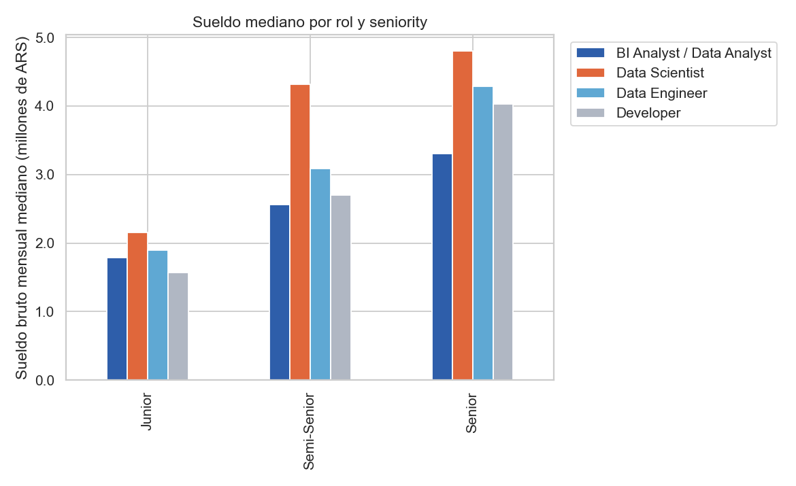
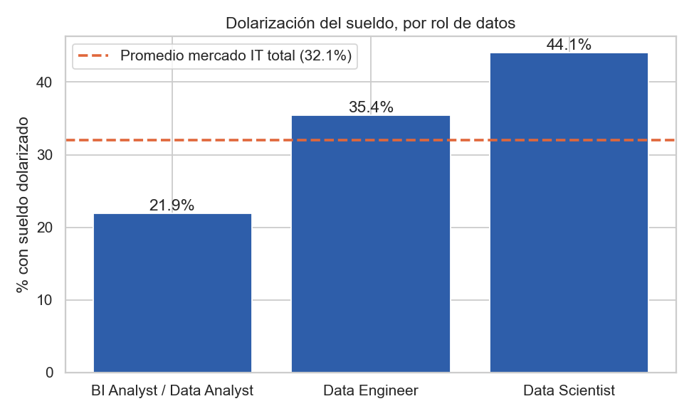
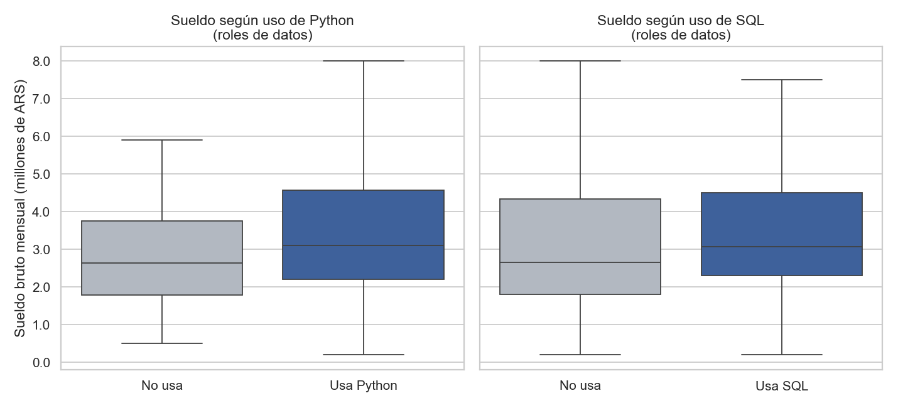

# ¿Conviene ser Data Analyst, Data Scientist o Data Engineer en Argentina en 2026?

Análisis exploratorio + generación de insights sobre la **Encuesta de Sueldos IT de sysarmy (edición 2026.1)** — 4.939 respuestas recolectadas en marzo de 2026.

## Por qué este proyecto

La pregunta "¿cuánto gana un Data Analyst?" tiene mil respuestas genéricas dando vueltas. Esta es una pregunta más específica y más útil para alguien eligiendo en qué especializarse dentro de datos: **¿hay diferencias reales de sueldo, protección ante la inflación o brecha de género entre Data Analyst, Data Scientist y Data Engineer en Argentina? ¿El stack técnico (Python, SQL) se traduce en mejor pago, o es solo intuición?**

## Insights principales

### 1. Sueldo por rol y seniority

Data Analyst arranca mejor que Developer en Junior, pero en Senior queda por debajo de Developer, Data Engineer y Data Scientist. Data Scientist es el mejor pago en las tres seniorities.

### 2. Protección ante la inflación (dolarización)

Data Analyst es el rol menos dolarizado (21.9%, vs. 32.1% del mercado IT general). Data Scientist es el más dolarizado (44.1%).

### 3. Brecha de género

Sin ajustar, ~5% menos para mujeres. Controlando por seniority, rol y años de experiencia (regresión OLS), el efecto deja de ser estadísticamente significativo (p=0.54, n=409) — resultado honesto, no concluyente en ninguna dirección con esta muestra.

### 4. Impacto de Python y SQL en el sueldo

Python: +17% de mediana (p=0.0027). SQL: +16% (p=0.047). No es solo un efecto de seniority — se mantiene dentro de cada nivel.

## Metodología

- **Limpieza:** manejo de las filas de instrucciones del export original, eliminación de columna duplicada, chequeo de nulos/outliers en sueldo.
- **Análisis:** medianas (no promedios, por la asimetría de la distribución de sueldos), regresión OLS para aislar el efecto de género de los confounds de seniority/rol/experiencia, test de Mann-Whitney para comparar grupos no paramétricos.
- **Herramientas:** Python, pandas, statsmodels, scipy, matplotlib/seaborn.

## Archivos

- `analisis_sueldos_data_roles_2026.ipynb` — notebook completo, ejecutable de punta a punta.
- `analisis_sueldos_data_roles_2026.html` — versión para ver en el navegador sin instalar nada.
- **Dataset (no incluido en el repo):** descargarlo desde [sysarmy](https://sysarmy.com/blog/posts/resultados-de-la-encuesta-de-sueldos-2026-1/) y guardarlo como `sueldos_sysarmy_2026_1.csv` en la misma carpeta del notebook.

## Limitaciones

Es una muestra de auto-selección (comunidad de sysarmy en redes/Discord), no aleatoria del mercado IT argentino; sueldos auto-reportados sin verificación; los roles de datos son ~8.5% de la muestra total, lo que limita cuánto se puede desagregar sin perder potencia estadística. Está desarrollado en detalle en la última sección del notebook.

## Fuente y licencia de los datos

Dataset publicado por [sysarmy](https://sysarmy.com/blog/posts/resultados-de-la-encuesta-de-sueldos-2026-1/) bajo licencia [Creative Commons Atribución-NoComercial-CompartirIgual 4.0 Internacional](https://creativecommons.org/licenses/by-nc-sa/4.0/deed.es). Este análisis es de uso no comercial (portfolio personal).

---
**Autor:** Agustín Luca Jeon — Estudiante de Lic. en Ciencias Físicas (UBA) | Data Analyst
